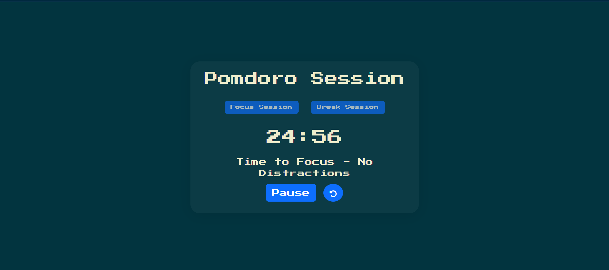

# Pomodoro Clock Version 1 ⏳

A stylish and functional Pomodoro Clock built using HTML, CSS, and JavaScript. Designed to help users manage time effectively using the Pomodoro Technique – alternating between focused work sessions and breaks.

 <!-- Optional: Replace with your screenshot -->

## 🚀 Features

- 🧠 **Focus & Break Modes** – Toggle between 25-minute focus sessions and 5-minute breaks.
- ⏸️ **Pause/Resume** – Pause and resume the timer without resetting progress.
- 🔄 **Reset Timer** – Reset to default at any time.
- 🎨 **Dynamic Theme Colors** – Background and text colors change dynamically every minute.
- 🔔 **Audio Alarm** – Notifies users when time is up.

## 🛠️ Built With

- HTML5
- CSS3 (with Bootstrap 5 for styling)
- JavaScript (Vanilla)

## 📦 Installation

To run the Pomodoro Clock locally:

1. Clone the repository:

   ```bash
   git clone https://github.com/your-username/pomodoro-clock.git

🤝 Contributing
Contributions, ideas, and bug reports are welcome!

Fork the project

Create your feature branch (git checkout -b feature/YourFeature)

Commit your changes (git commit -m 'Add some feature')

Push to the branch (git push origin feature/YourFeature)

Open a pull request
